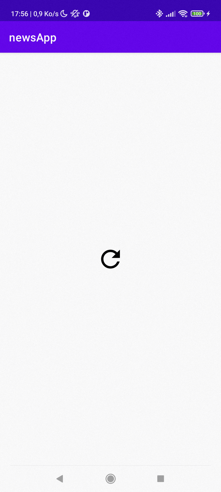
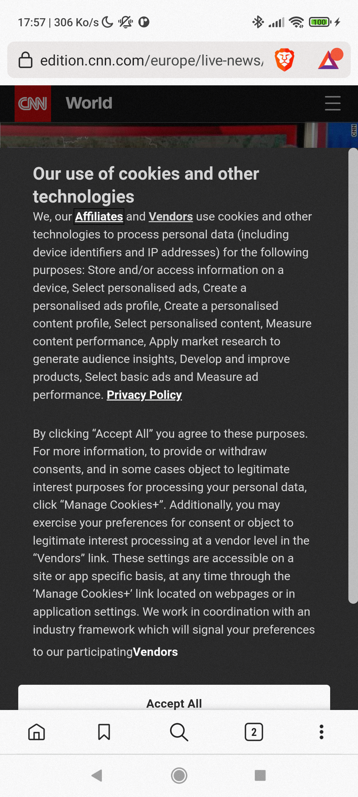
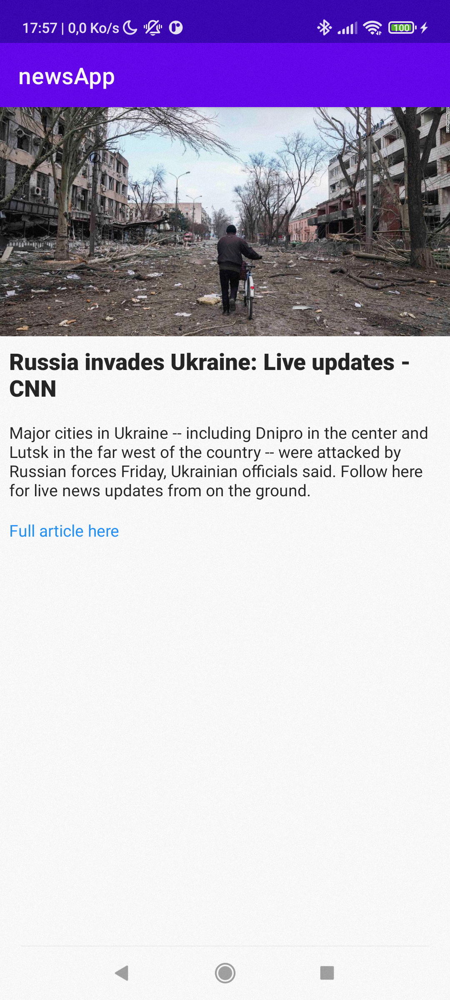

# news-app

## How to use it ?

On start the app load the list of news, while the app is waiting for the list of news the loading
screen is displayed

Now you are on the home screen where all news are displayed, you can press the news you want to
read.

So you are redirected on the de detail page where you have more information. If you press the blue
text you will be redirected to the web page of the article.

You have the full article.

## Development

I choose to implement a **MVVM** architecture.

I use Retrofit to retrieve the text data from the ApiNews and Picasso to download and place the
image onto the UI. ( Picasso has the ability to store images automatically and when you want ot get
another time the image, it is load from the local data without internet call)

I also did a UI test to know if the full process can be done by the app.

## possible improvements

Adding more UX friendly interface, with a Splashscreen and a custom Top Bar for example.